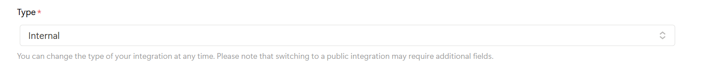

# Notion and Todoist Task Integration with API's

## Demo 

A demo of this project is available [here](https://www.threads.net/@farooqureshii/post/C-O6CoNPwN7).

## Getting Started

Clone the repository. 

```bash
git clone https://github.com/farooqqureshii/notion-todoist-integration.git
cd notion-todoist-integration
```

This script also uses the requests library, which can be installed using the pip command. 

## Setupt

The script requires 4 pieces of information to work, this can be found at the top of the tasks.py file.

```python
TODOIST_API_TOKEN = ""
NOTION_API_TOKEN = ""
NOTION_DATABASE_ID = ""
TODOIST_INBOX_PROJECT_ID = ""  
```

Here is how to find each of these. 

### Todoist API Token

Open the Todoist app (on desktop or web) and navigate to the settings tab by clicking on your icon in the top left corner. From there, select the “Integrations” tab in the menu, and click “Developer” at the top of that page. Your API token is right below the “Explore the API” heading, and can be copy pasted with a single click. 

The token should be a series of alphanumeric characters. 

### Notion API Token

Head over to [https://www.notion.so/profile/integrations](https://www.notion.so/profile/integrations) and hit “New Integration” and name it whatever you please.


Hit the new integration button 

Select the workspace that you use, and keep the “Type” to Internal. 



Ensure the Type is internal

After creating the integration, it should take you to a a page that has the “Internal Integration Secret” on it, that is your API Token.

### Notion Database ID

This is an **IMPORTANT** step! Go into your Notion workspace and create a database that looks as follows. 


The name of the database is not important, but the name of the columns is, so **make sure they match!** 

After you’ve done that, it’s time to get your database ID. To do this, open Notion in the web and navigate to your database. 

Your database ID are the 32 characters that are listed after your username, but before the ?v=

For example: 

https://www.notion.so/[yourusername]/[YOURID]?v=...

**IMPORTANT: For this script to work, you must go to the page where your database is, click the three dots at the top right, and click “Connect to” at the bottom. Scroll down the list until you find the name of the integration that you made in the previous step.**

### Todoist Inbox Project ID.

Open your Todoist Inbox project, click on the 3 dots in the left, and select “Copy project link”. 

Paste that somewhere, and it should look something like this. 

https://app.todoist.com/app/project/inbox-[somecharacters] 

Those characters are the ID to put in.

## Running the script

To run the script, go into your devices command prompt, type in the path to the folder that contains the script. And type. 

```bash
python tasks.py
```

And your tasks should show up in your Notion database!

## Extra & Notes

The script only adds tasks that are not currently in your Notion database. I tend to run the script at the end of each day to keep tasks in my Todoist also in Notion. Other services do offer an integration like this, but they typically have usage limits and are hard to keep running over time. Overtime, this line of code may have to be changed, as a new version of the API may be released. 

```bash
"Notion-Version": "2022-06-28"  # this is not the version of notion that you are on, but rather the api version -see the readme file for more
```

This project was made with the great resources for the [Todoist](https://developer.todoist.com/guides/#developing-with-todoist) and [Notion](https://developers.notion.com/)  API’s.
